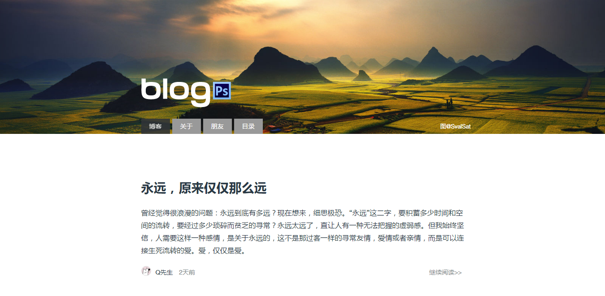

# Ink主题-Simple

这是一个以 `纸小墨` 默认的主题为参考，简单设计的主题，适用于 `纸小墨` 静态博客系统使用。

## 下载地址
`纸小墨` http://www.chole.io/blog/ink-blog-tool.html

`主题` https://github.com/myiq/ink-simple

## 预览

最直接的方式 → 来我的博客看看 https://blog.ps

## 使用说明

### 第一步

下载本主题，复制到`blog`目录下

### 第二步

更改`config.yml`下的主题选项`theme: ink-simple`

### 第三步

更改下面的文件为自己的

| `文件`  |   `功能`   |   `描述`   |
| :-------- | --------:| :------: |
| `_commnet.html`|   评论插件 |  默认是Disqus，大家可以根据需要修改成 `多说`、 `畅言`等  |
| `_footer.html`|   页足 |  版权信息，没啥添加，就别修改了  |
| `_head.html`|   顶部文件|  关键词、title等内容，同样能不改就不改了  |

### 第四步
渲染，预览，上传